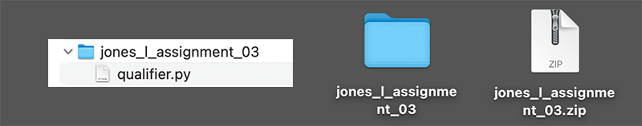

# Assignment 03

**concepts:** *create constants, create variables to compare to constants, casting string as integer (int), input, if-else, boolean comparison, output, output text and constants in f-string*

First, imagine yourself in the role of programmer. You are working for a client, and the client has a problem where they need to evaluate at least two conditions entered by a user. You as a programmer need to set the target CONSTANTS and then provide a way for the user to enter data that can be compared against the constants data. Then you need to evaluate that data then print out that data for the user informing them if they meet, or do not meet, the requirements and then reveal to them the requirements.

The goal of this assignment is to use this pattern to create something original. In class we looked at the Loan Qualifications sample and then a job qualification sample was demonstrated. There are two more samples shown in these instructions. Be sure not to submit one of the examples for you final assignment. Make it your own.

*We have not yet covered how to collect the data and save it so the client could collect hundreds or thousands of user submissions. We will get to that later in the semester.* 

Here are some "general" naming examples:

```python
# Constants are all caps
MAX_OR_MIN_CONSTANT_1 = 2
MAX_OR_MIN_CONSTANT_2 = 1

# keep variables lowercase. Avoid capitalizing the first letter.
user_entered_value_for_constant_1 = 5
user_entered_value_for_constant_2 = 7
```
In the above example, you can see right away that the user values are greater
than the constants. Depending on the max or min situation, that can be desirable for the 
client, and user, or undesirable:

```python
# Desireable: Sales Manager qualifications
MIN_YEARS_SELLING CARS = 2
MIN_SALESMAN_OF_THE_YEAR = 1

years_selling_exp = 5
salesman_of_the_year = 7 # User error maybe? (7 < 5)
```

```python
# Undesirable: Truck Driver Requirement
MAX_SPEEDING_VIOLATIONS = 1
MAX_DUI = 0

speeding_violations = 5
dui = 7 
```

If you were not collecting the user input and you were provided the input, the coding would be easier:

```python
# No user input; data for Ted Smith provided.
MIN_YEARS_SALES = 2
MIN_YEARS_TOP_AWARD = 1

# Ted's provided data:
years_sales = 5
years_top_award = 7 # User error, admin error, programmer error?

if years_sales > MIN_YEARS_SALES and years_top_award > MIN_YEARS_TOP_AWARD:
    print('Ted you are eligible the Sales Manager Position.')
else:
    print('Ted, you are not eligible the Sales Manager Position.')
```

This is not very efficient, but it helps understand the programming logic. What we really need to do is make this program so that we can collect application data from lots of applicants and save it. 

>*Again, we are not yet ready to learn how to save the data. We are concerned with learning how to set constants, variables, get user input, process that input, and display the processed input results.* 

At this point the constants, variables, and processing are working fine. So we need to take the Ted Smith References out of the comments and make the program able to collect data from any user. We do this more efficiently by combining the `int` and the `input` on one line:

```python
# Requirements for Sales Manager Position
MIN_YEARS_SALES = 2
MIN_YEARS_TOP_AWARD = 1

# User's provided data:
years_sales = int(input('Enter your years of sales experience: '))
years_top_award = int(input('Enter how many years you have been salesperson of the year: ')) # any error would be user error in this case.

if years_sales > MIN_YEARS_SALES and years_top_award > MIN_YEARS_TOP_AWARD:
    print('You are eligible the Sales Manager Position.')
else:
    print('You are not eligible the Sales Manager Position.')
```
The final step in this project is for you to let your user know why they did not meet the requirements by revealing the constants. To do this you need only reference the constant variables. Also, since Assignment 05 really requires you to use a multi-line f-string, practice making your f-string with your variables. It is really a pretty elegant solution.

Step 1:

1. If you tested a simple print output after the else, delete the contents.
2. Start with an empty print function: `print()` after the  `else:` 
3. Click into parentheses and add an f and three single quotes inside the parentheses: ```print(f''')``` 
4. Next, open up the parentheses by entering at least one return and add three more single quotes before the closing parenthesis:

```python
else:
print(f'''

''')
```
Step 2:
Add in your Constants. 

```python
else:
print(f'''

{MIN_YEARS_SALES}     
{MIN_YEARS_TOP_AWARD}

''')
```
If you ran this, then you would see your Constants printed out with extra space.

Step 3: Enter any additional text descriptions, as you like, with any spacing you like.
```python
else:
print(f'''

Text...
Text... {MIN_YEARS_SALES}     Text...
Text... {MIN_YEARS_TOP_AWARD} Text...
Text...

''')
```
Once you have completed all of these steps and made it original, put your file in a folder with your lastname first, with first initial, zip it up and upload  it to Canvas.


