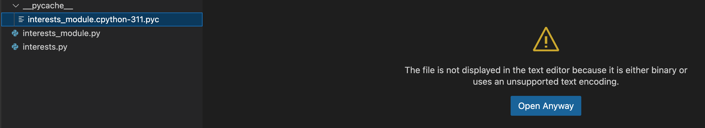

# Assignment 05

**concepts:** *html generation, variables, f-strings, for loop nested between strings, function, module, and import.*

This is a full-fledged program that will challenge you to create something that is actually quite useful: A webpage generator. This primes us for moving on to more advanced programming concepts in the working with data module.


1. Create a `lastname_first-initial_assignment_5` folder. Inside of that folder, create a file named ```interests.html```.

>You do not need to understand HTML to do this assignment. Any small bits of knowledge you need will be provided. This is mostly a python project.

2. On the first line of interests.html enter `html` and pause. you will see some html choices presented. Choose `html5`. That will create a basic html page template for you. 

3. You should see something like this:
```html
<!DOCTYPE html>
<html lang="en">
<head>
    <meta charset="UTF-8">
    <meta name="viewport" content="width=device-width, initial-scale=1.0">
    <title>Document</title>
</head>
<body>
    
</body>
</html>
```

4. Rename the file to `interests.py` and then surround the all the text with an f-string like this:

```python
print(f'''
<!DOCTYPE html>
<html lang="en">
<head>
    <meta charset="UTF-8">
    <meta name="viewport" content="width=device-width, initial-scale=1.0">
    <title>Document</title>
</head>
<body>
    
</body>
</html>
''')
```
5. Save the file. Test the program and make sure it runs.

6. Next, create two variables at the top of the page:

```python
# Not First Last, but your actual name. We will use this for 
# title and copyright. The copyright html symbol is &copy;
name = 'First Last'

# we will use this for the title and the h1
page_topic = 'My Interests'

# Insert the variables in the  multi-line f-string as shown below:
print(f'''
<!DOCTYPE html>
<html lang="en">
<head>
    <meta charset="UTF-8">
    <meta name="viewport" content="width=device-width, initial-scale=1.0">
    
    <title>{name} | {page_topic}</title>
</head>
<body>
    <h1>{page_topic}</h1>

&copy; {name}
</body>
</html>
''')
```
7. Save program and test to make sure you don't have any errors so far.

8. Now create another file named `interests_module.py`. In that folder you are going to create a loop for your interests. This is similar to what you did in assignment 2.

```python
interests = ['swimming','hiking', 'reading', 'gaming']
   
    for interest in interests:
        print(interest)
```
We are going to import this list into the `interests.html` file.

To do that we need to make this into a function by adding this line to the top of the loop:

```python 
def interests_loop():
```

Added: 
```python
def interests_loop(): 
    interests = ['swimming','hiking', 'reading', 'gaming']
   
    for interest in interests:
        print(interest)
```

However, html requires that lists be contained in an ordered list `<ol>`, or an unordered list `<ul>` with `<li>` tags, like this:

```html
<ul>
    <li>item1</li>
    <li>item2</li>
    <li>item2</li>
</ul>
```
Therefore, we need to edit the loop in the function and add these tags like this:

```python
def interests_loop(): 
    interests = ['swimming','hiking', 'reading', 'gaming']
    print('<ul>') # Add this outside the loop: above
    for interest in interests:
        print(f'<li>{interest}</li>') # this will loop out multiple lines
    print('</ul>') #Add this outside the loop: below
```
Your loop within the function is ready to be imported into the `interests.py` file.

Go back to your `interests.py` file and enter this line at the top:

```python
from interests_module import interests_loop
```
Finally, go to the bottom of the file and put the interests loop under the the h1 tag:

```python
''' ...
    ...
<body>
    <h1>{page_topic}</h1>''') # you must terminate your f-string here.
interests_loop()  # The function call cannot be in the f-string.

# you need to start another f-string 
print(f'''&copy; {name} 
</body>
</html>
''') # terminate second f-string.
```

Now you should be able to run your program an generate a web page from variables and a function:

```html
<!DOCTYPE html>
<html lang="en">
<head>
    <meta charset="UTF-8">
    <meta name="viewport" content="width=device-width, initial-scale=1.0">
    
    <title>First Last | My Interests</title>
</head>
<body>
    <h1>My Interests</h1>
<ul>
<li> swimming </li>
<li> hiking </li>
<li> reading </li>
<li> gaming </li>
</ul>
&copy; First Last
</body>
</html>
```

When your have the program working as intended, you will notice that you now have a pycache file in your folder:



That is there because Python uses that file to run your code faster and without using as much of your system resources. 

When finished, you should zip up your folder containing your files, including the pycache file, and submit it for Assignment 05 in Canvas.